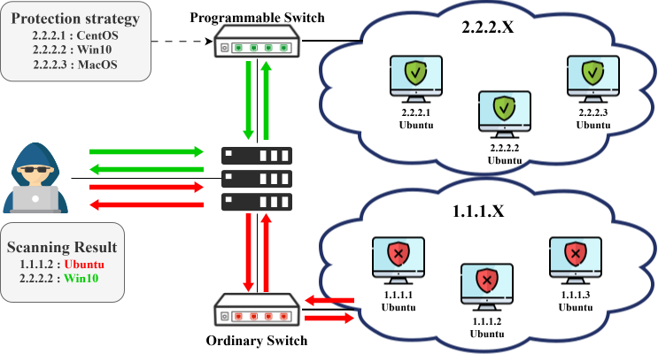
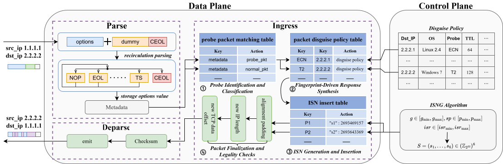

<p align="center">
  
</p>

<h1 align="center">OSDisguise</h1>

<p align="center">
  <strong>在可编程交换机数据面中伪装操作系统指纹</strong><br>
  面向 Nmap 主动扫描与 p0f 被动识别的透明、线速、子网级防护
</p>

<p align="center">
  <a href="README_EN.md">English</a> ·
  <strong>简体中文</strong> ·
  <a href="#快速开始">快速开始</a> ·
  <a href="#系统架构">系统架构</a> ·
  <a href="#完整文档">完整文档</a>
</p>

<p align="center">
  
  
  
  
  <a href="LICENSE"></a>
</p>

---

## 系统架构

### 主动指纹伪装 - Nmap

主动扫描器向受保护主机发送特制探针。交换机完成 TCP Option 循环解析、探针分类、策略匹配、响应合成和 ISN 注入，再把具有目标操作系统特征的响应返回给扫描器。

<p align="center">
  
</p>

### 被动指纹伪装 - p0f

被动观察者不会发送探针，而是根据正常 TCP 流量推断源主机系统。OSDisguise 在转发路径中匹配业务包，应用目标指纹策略并修复校验和，使观察到的 SYN 特征与真实主机解耦。

<p align="center">
  
</p>

当前公开实验系统提供 **Nmap 主动模式、p0f 被动模式和独立监测转发模式**。

OSDisguise 将操作系统指纹伪装从受保护主机迁移到网络数据面。它在 **Intel Tofino1 / Barefoot SDE 9.7.0 / P4_16** 上识别指纹探针，按目标策略重构 IP/TCP 字段与 TCP Options，并插入时间一致的 Initial Sequence Number (ISN)。受保护主机无需安装内核补丁、Netfilter 模块或常驻代理。

> 论文实验结果：OSDisguise 面向数千条真实操作系统指纹进行评估，对 Nmap 和 p0f 的平均伪装成功率分别达到 **92.48%** 和 **85.97%**，同时保持 **100 Gbps** 线速转发。

| **92.48%** | **85.97%** | **100 Gbps** | **Subnet-wide** |
|:---:|:---:|:---:|:---:|
| Nmap 平均伪装成功率 | p0f 平均伪装成功率 | Tofino1 线速转发 | 一台交换机保护整个子网 |

## 为什么需要 OSDisguise

操作系统指纹是漏洞利用之前的重要侦察步骤。扫描器会综合 TTL、TCP Window、Flags、Options 顺序、分片行为以及跨报文 ISN 演化推断目标系统。传统主机侧方案需要逐台部署，并会占用 CPU、内核和 NIC 资源；简单丢弃探针又会形成不自然的网络行为。

OSDisguise 的核心思路是把复杂的指纹语义拆成数据面友好的操作：

| 机制 | 作用 |
|---|---|
| **Recirculation parser** | 通过循环解析突破固定解析深度，识别可变长度 TCP Options 与探针类型。 |
| **Multi-slot option construction** | 使用多个可编程槽位重构 MSS、SACK、Timestamp、Window Scale 等选项及其顺序。 |
| **ISNG algorithm** | 在控制面离线生成满足 GCD、ISR、SP 约束的 ISN 序列，数据面仅做查表与插入。 |
| **Match-action disguise** | 按目的主机、探针和目标 OS 选择策略，并在线完成字段改写、长度修正与校验和更新。 |

## 仓库提供什么

| 模式 | 数据面程序 | 控制面 | 用途 |
|---|---|---|---|
| `monitor` | `monitor/scan_monitor/scan_monitor.p4` | `monitor/scan_monitor/controller.py` | 保持业务转发并统计 Nmap 探针，不修改指纹。 |
| `nmap` | `nmap_tofino.p4` | `test_nmap/test.py` | 识别主动探针并生成目标 OS 响应。 |
| `p0f` | `p0f_tofino.p4` | `test_p0f/test.py` | 改写正常 TCP SYN，使被动观察结果呈现目标 OS。 |
| Web 控制台 | `HTML/` | Flask + BFRT 适配器 | 管理模式、指纹库、进程确认、链路状态与扫描遥测。 |

默认实验链路：

```text
nic-1 (192.168.3.1)  ── DEV_PORT 60 ──>  Tofino1  ── DEV_PORT 52 ──>  nic-2 (192.168.3.2)
       scanner / client                    P4 data plane                protected host / observer
```

三个模式共享一台 ASIC，必须串行切换。Nmap 与 p0f 数据面分别编译并缓存，更换指纹只更新表项，不需要重新编译 P4。

## 快速开始

> 需要 Tofino1 硬件、合法安装的 Barefoot SDE 9.7.0，以及能够驱动当前交换机的 platform configuration。普通电脑不能直接运行本项目的数据面。

在 **Tofino1 的项目根目录**执行：

```bash
export SDE=/root/bf-sde-9.7.0
python3 scripts/configure.py --sde "$SDE"

# 必须替换为本台交换机已经验证可用的硬件配置。
export PLATFORM_CONFIG="$SDE/install/share/p4/targets/tofino/antiFpProbe.conf"
/usr/bin/python3 scripts/build.py all --platform-config "$PLATFORM_CONFIG"
/usr/bin/python3 scripts/doctor.py
```

打开两个 Tofino 终端，先启动数据面，再启动相同模式的控制面：

```bash
# Terminal 1: monitor、nmap 或 p0f
bash scripts/data.sh nmap
```

```bash
# Terminal 2: 等待 Terminal 1 完成设备初始化
bash scripts/control.sh nmap
```

完整编译、端口、网卡内核驱动恢复和连通性检查见 [部署文档](docs/部署.md)。网页启动与停止见 [HTML 控制台文档](docs/HTML.md)。

## 完整文档

| 文档 | 内容 |
|---|---|
| [部署与环境检查](docs/部署.md) | 三台机器、物理连线、SDE 环境、初始化、编译与自检。 |
| [Nmap 实验](docs/Nmap.md) | 监测转发、主动指纹伪装、扫描与指纹切换。 |
| [p0f 实验](docs/p0f.md) | 被动指纹伪装、采集器、iperf2 流量与验收。 |
| [Web 控制台](docs/HTML.md) | 服务管理、模式切换、冲突确认、遥测与指纹库。 |
| [架构与排障](docs/架构与排障.md) | DPDK/内核驱动、Python ABI、链路就绪与端到端联通。 |
| [验证记录](docs/验证记录.md) | 自动化测试、编译和硬件验证范围。 |
| [发布与来源说明](docs/发布说明.md) | 许可证边界、第三方声明与脱敏导出。 |

<details>
<summary><strong>查看仓库结构</strong></summary>

```text
.
├── antiFpProbe.p4                 # Nmap / p0f 编译开关入口
├── nmap_tofino.p4                 # 主动指纹伪装数据面
├── p0f_tofino.p4                  # 被动指纹伪装数据面
├── common/                        # P4 公共头文件
├── configs/                       # 示例 IPv4 与 ARP 规则
├── test_nmap/                     # Nmap 控制面与初始指纹
├── test_p0f/                      # p0f 控制面、规范化和示例
├── monitor/scan_monitor/          # 独立监测转发模式
├── HTML/                          # Web 应用、适配器、采集器与指纹库
├── scripts/                       # 配置、构建、自检、启动和导出
├── tests/                         # 控制面单元测试
└── docs/                          # 中英文实验与发布文档
```

`build/`、`HTML/runtime/`、`.venv/` 和 `config/deployment.json` 是部署后生成的私有内容，不进入源码仓库。

</details>

## 论文

**OSDisguise: Disguising OS Fingerprints Against Network Scanning in the Data Plane**<br>
Xiaochuan Guo, Kun Xie, Ke Xu, Xin Zeng, Ziyang Peng, Jigang Wen, Yanbiao Li, Xiaocan Li, Guangxing Zhang, and Gaogang Xie.

论文中的完整评估还包含消融实验、资源开销、吞吐量和面向数千受保护主机的扩展性分析。本仓库用于复现公开代码中的 Tofino1、Nmap、p0f 与监控控制台工作流。

## 使用边界与许可

- 仅在自己拥有或已获授权的测试网络运行扫描、抓包和流量实验。
- 指纹格式校验通过不等于每个操作系统版本都完成了端到端硬件验证，运行时兼容性检查仍然保留。
- 作者拥有版权的代码、部署脚本和文档采用 [Apache License 2.0](LICENSE)。第三方文件不自动变更许可证，详见 [NOTICE](NOTICE) 和 [发布说明](docs/发布说明.md)。

<p align="center"><sub>Research prototype for authorized network-defense experiments.</sub></p>
